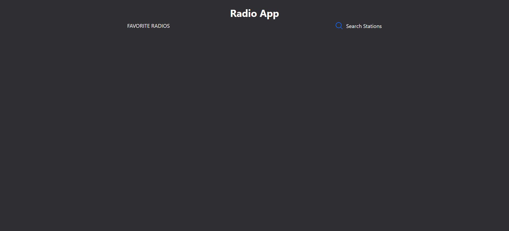
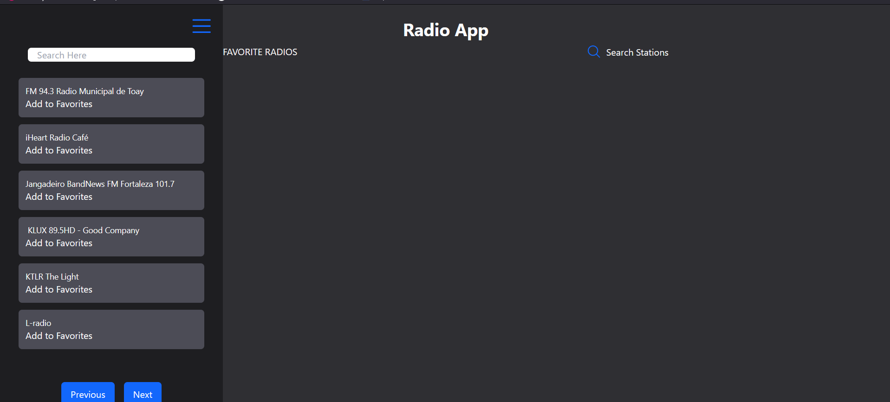
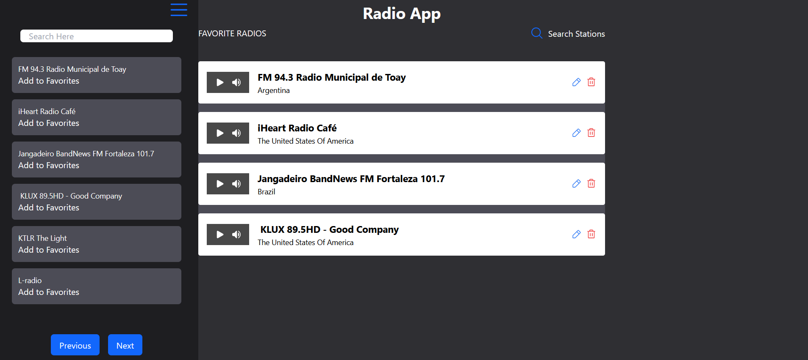

## Radio App

Este é um projeto de exemplo de uma aplicação de rádio online, onde os usuários podem explorar e adicionar rádios aos favoritos.

### Como usar o projeto

1. **Instalação de dependências**

  Certifique-se de ter o Node.js instalado em sua máquina. Em seguida, execute o seguinte comando para instalar as dependências do projeto:
  ```
  npm install
  ```


2. **Executando a aplicação**

Para executar a aplicação, utilize o seguinte comando:
```
npm run dev
```

Isso iniciará o servidor de desenvolvimento e a aplicação estará acessível em [http://localhost:3000](http://localhost:3000).

3. **Explorando e adicionando rádios favoritas**

Ao iniciar a aplicação, você verá a lista de suas rádios favoritas, se houver alguma. Você pode adicionar rádios aos favoritos pesquisando por nome e país no menu lateral "Search Stations". Digite o termo de pesquisa e as rádios correspondentes serão exibidas em tempo real. Clique no botão "Add to Favorites" para adicionar uma rádio aos favoritos.

4. **Reproduzindo rádios favoritas**

Para reproduzir uma rádio favorita, clique no botão de play ao lado do nome da rádio na lista de favoritos. O áudio da rádio será reproduzido em um player embutido.

5. **Editando e removendo rádios favoritas**

Na lista de favoritos, você pode editar o nome de uma rádio clicando no ícone de lápis. O nome da rádio será transformado em um campo de edição, onde você pode fazer alterações. Clique no ícone de "check" para salvar as alterações ou no ícone de "cancel" para descartar as alterações.

Para remover uma rádio dos favoritos, clique no ícone de lixeira ao lado do nome da rádio.

### Tecnologias utilizadas

- React.js
- TypeScript
- axios
- @phosphor-icons/react

### Aplicativo por Dentro

Página Inicial


Área de Pesquisa


Radios Favoritas


### Contribuição

Contribuições são bem-vindas! Se você quiser contribuir com este projeto, sinta-se à vontade para fazer um fork e enviar uma pull request.

### Licença

Este projeto está licenciado sob a licença [MIT](https://opensource.org/licenses/MIT).
